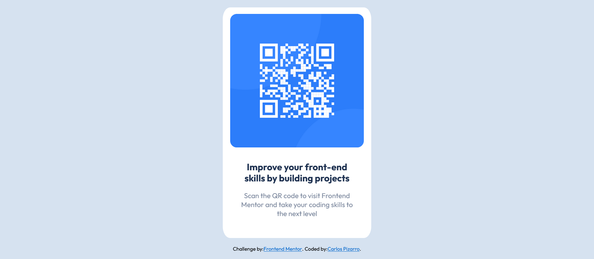

# Frontend Mentor - QR code component solution

This is a solution to the [QR code component challenge on Frontend Mentor](https://www.frontendmentor.io/challenges/qr-code-component-iux_sIO_H).

## Table of contents

- [Overview](#overview)
  - [Screenshot](#screenshot)
  - [Links](#links)
- [My process](#my-process)
  - [Built with](#built-with)
  - [What I learned](#what-i-learned)
  - [Continued development](#continued-development)
  - [Useful resources](#useful-resources)
- [Author](#author)

## Overview

### Screenshot

### Links

- Solution URL: [solution URL](https://your-solution-url.com)
- Live Site URL: [live site URL](https://qr-component-card-01.netlify.app/)

## My process

### Built with

- Semantic HTML5 markup
- CSS custom properties
- Flexbox
- CSS Grid
- SCSS

### What I learned

The project helped me review concepts related to CSS custom properties and Flexbox. It also encouraged me to revisit how to set up and work with SCSS.

### Continued development

-Responsive design
-JavaScript projects
-API projects

### Useful resources

- [(https://sass-lang.com/)] - This website provides all the information and documentation on how to set up SCSS in a project.

## Author

- Website - [Carlos Pizarro](https://github.com/IncorrigibleSpirit)
- Frontend Mentor - [@IncorrigibleSpirit](https://www.frontendmentor.io/profile/IncorrigibleSpirit)
