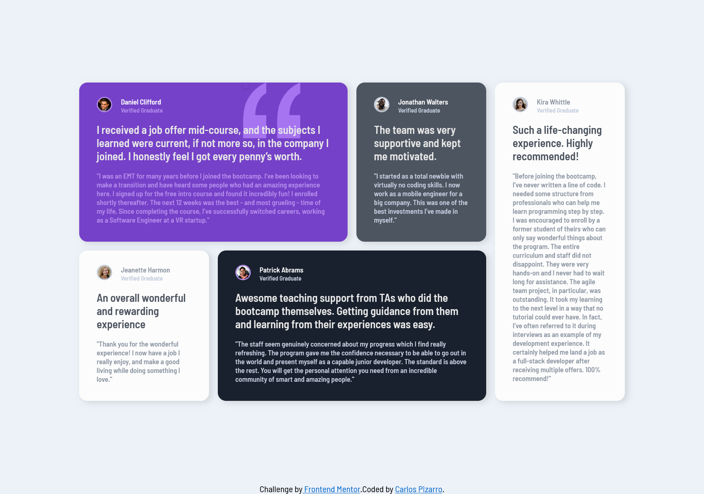

# Frontend Mentor - Testimonials grid section solution

This is a solution to the [Testimonials grid section challenge on Frontend Mentor](https://www.frontendmentor.io/challenges/testimonials-grid-section-Nnw6J7Un7).

## Table of contents

- [Overview](#overview)
  - [The challenge](#the-challenge)
  - [Screenshot](#screenshot)
  - [Links](#links)
- [My process](#my-process)

  - [Built with](#built-with)
  - [What I learned](#what-i-learned)
  - [Continued development](#continued-development)

- [Author](#author)

## Overview

### Screenshot

### Links

- Solution URL: [Add solution URL here](https://your-solution-url.com)
- Live Site URL: [Add live site URL here](https://your-live-site-url.com)

## My process

### Built with

- Semantic HTML5 markup
- CSS custom properties
- Flexbox
- CSS Grid
- Mobile-first workflow
- Sass

### What I learned

It was an excellent exercise for practicing CSS Grid, pseudo-classes, and responsive design.

### Continued development

-Responsive design
-JavaScript vanilla

## Author

- Website - [Carlos Pizarro](https://github.com/IncorrigibleSpirit)
- Frontend Mentor - [@IncorrigibleSpirit](https://www.frontendmentor.io/profile/IncorrigibleSpirit)
