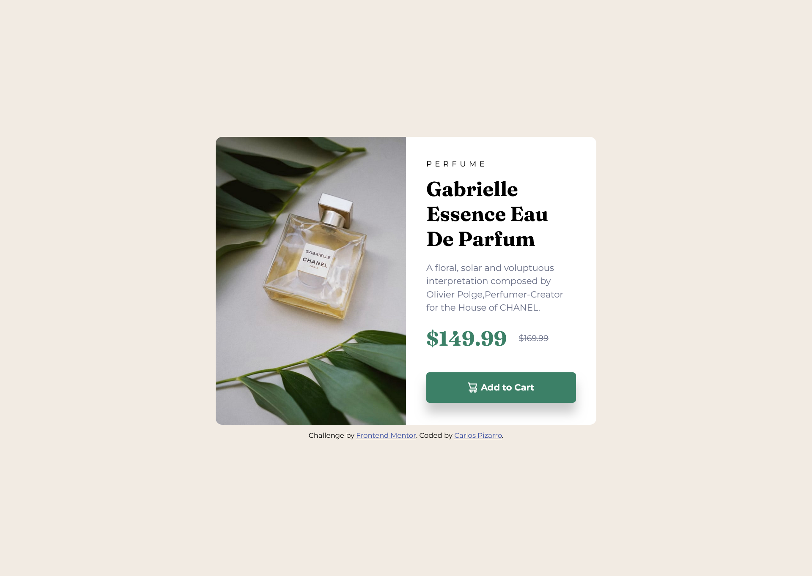

# Frontend Mentor - Product preview card component solution

This is a solution to the [Product preview card component challenge on Frontend Mentor](https://www.frontendmentor.io/challenges/product-preview-card-component-GO7UmttRfa).

## Table of contents

- [Overview](#overview)
  - [The challenge](#the-challenge)
  - [Screenshot](#screenshot)
  - [Links](#links)
- [My process](#my-process)
  - [Built with](#built-with)
  - [What I learned](#what-i-learned)
  - [Continued development](#continued-development)
  - [Useful resources](#useful-resources)
- [Author](#author)
- [Acknowledgments](#acknowledgments)

## Overview

### The challenge

Users should be able to:

- View the optimal layout depending on their device's screen size
- See hover and focus states for interactive elements

### Screenshot

### Links

- Solution URL: [Github](https://github.com/IncorrigibleSpirit/front-end-challenges/tree/6-product-preview-card-component)
- Live Site URL: [Netlify](https://product-preview-card-component-02.netlify.app/)

## My process

### Built with

- Semantic HTML5 markup
- CSS custom properties
- Flexbox
- Saas

### What I learned

During this project, I reviewed some concepts related to designing responsive layouts and working with images.

### Continued development

-Responsive design
-JavaScript projects
-API projects

## Author

- Website - [Carlos Pizarro](https://github.com/IncorrigibleSpirit)
- Frontend Mentor - [@IncorrigibleSpirit](https://www.frontendmentor.io/profile/IncorrigibleSpirit)
