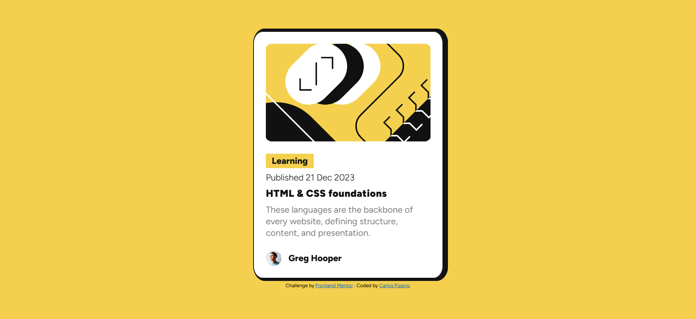

# Frontend Mentor - Blog preview card solution

This is a solution to the [Blog preview card challenge on Frontend Mentor](https://www.frontendmentor.io/challenges/blog-preview-card-ckPaj01IcS).

## Table of contents

- [Overview](#overview)
  - [The challenge](#the-challenge)
  - [Screenshot](#screenshot)
  - [Links](#links)
- [My process](#my-process)
  - [Built with](#built-with)
  - [What I learned](#what-i-learned)
  - [Continued development](#continued-development)
  - [Useful resources](#useful-resources)
- [Author](#author)

**Note: Delete this note and update the table of contents based on what sections you keep.**

## Overview

### The challenge

Users should be able to:

- See hover and focus states for all interactive elements on the page

### Screenshot

### Links

- Solution URL: [Link](https://github.com/IncorrigibleSpirit/front-end-challenges/blob/2-challenge-blog-preview-card/blog-preview-card-main/README.md)
- Live Site URL: [Link](https://blog-preview-card-01.netlify.app/)

## My process

### Built with

- Semantic HTML5 markup
- CSS custom properties
- Flexbox
- Sass

### What I learned

During this project, I reviewed some concepts related to designing layouts and working with images and hyperlinks. Additionally, I learned and applied new concepts about typography, such as "fluid typography" and "variable fonts." Honestly, it was the first time I had heard about them, and I had a great experience calculating formulas and learning about the possibilities that variable fonts offer.

### Continued development

-Responsive design
-JavaScript projects
-API projects

### Useful resources

- [Modern Fluid Typography Using CSS Clamp](https://www.smashingmagazine.com/2022/01/modern-fluid-typography-css-clamp/) - This article illustrates how to correctly calculate fluid typography.

- [Getting started with Variable fonts on the web](https://www.youtube.com/watch?v=0fVymQ7SZw0&t=642s) - This video offers a meaningful overview concerning variable fonts and also shares useful resources and tips for working with typography in our projects.

## Author

- Website - [Carlos Pizarro](https://github.com/IncorrigibleSpirit)
- Frontend Mentor - [@IncorrigibleSpirit](https://www.frontendmentor.io/profile/IncorrigibleSpirit)
