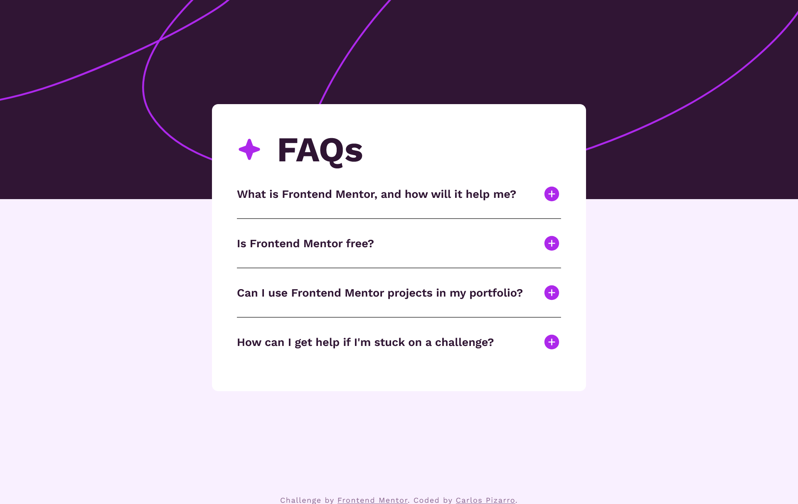

# Frontend Mentor - FAQ accordion solution

This is a solution to the [FAQ accordion challenge on Frontend Mentor](https://www.frontendmentor.io/challenges/faq-accordion-wyfFdeBwBz).

## Table of contents

- [Overview](#overview)
  - [The challenge](#the-challenge)
  - [Screenshot](#screenshot)
  - [Links](#links)
- [My process](#my-process)
  - [Built with](#built-with)
  - [What I learned](#what-i-learned)
  - [Continued development](#continued-development)
- [Author](#author)

## Overview

### The challenge

Users should be able to:

- Hide/Show the answer to a question when the question is clicked
- Navigate the questions and hide/show answers using keyboard navigation alone
- View the optimal layout for the interface depending on their device's screen size
- See hover and focus states for all interactive elements on the page

### Screenshot



### Links

- Solution URL: [github](https://github.com/IncorrigibleSpirit/front-end-challenges/tree/5-FAQ-accordion/faq-accordion-main)
- Live Site URL: [Add live site URL here](https://faq-accordion-01.netlify.app/)

## My process

### Built with

- Semantic HTML5 markup
- CSS custom properties
- Flexbox
- Saas

### What I learned

Overall, I learned to use the <details> and <summary> tags in HTML for creating collapsible sections. Additionally, I explored how to incorporate JavaScript to toggle classes and enable keyboard navigation through properties."

```JS
document.querySelectorAll(".faq_heading").forEach((heading) => {
  heading.addEventListener("click", () => {
    const faqItem = heading.parentElement;
    faqItem.classList.toggle("active");
  });
});
```

```css
:focus-visible {
  outline: 0.1875rem dotted #9b59b6;
  outline-offset: 0.125rem;
}
```

### Continued development

-Responsive design
-JavaScript projects
-API projects

## Author

- Website - [Carlos Pizarro](https://github.com/IncorrigibleSpirit)
- Frontend Mentor - [@IncorrigibleSpirit](https://www.frontendmentor.io/profile/IncorrigibleSpirit)
