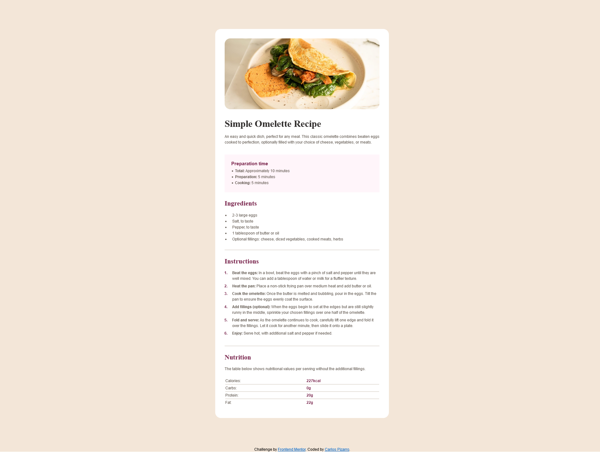

# Frontend Mentor - Recipe page solution

This is a solution to the [Recipe page challenge on Frontend Mentor](https://www.frontendmentor.io/challenges/recipe-page-KiTsR8QQKm).

## Table of contents

- [Overview](#overview)
  - [The challenge](#the-challenge)
  - [Screenshot](#screenshot)
  - [Links](#links)
- [My process](#my-process)
  - [Built with](#built-with)
  - [What I learned](#what-i-learned)
  - [Continued development](#continued-development)
- [Author](#author)

## Overview

### Screenshot



### Links

- Solution URL: [Add solution URL here](https://your-solution-url.com)
- Live Site URL: [Add live site URL here](https://your-live-site-url.com)

## My process

### Built with

- Semantic HTML5 markup
- CSS custom properties
- Flexbox
- Sass

### What I learned

Please remember this: Overall, the project was manageable. However, creating the table at the bottom of the recipe required specific attention. It was important to review how to use "colspan" to merge cells and to insert separators using "<HR>"

```html
<tr>
  <td class="nutrition_item">Calories:</td>
  <td><strong class="nutrition_value">227kcal</strong></td>
</tr>
<tr class="nutrition-separator">
  <td colspan="2"><hr /></td>
</tr>
<tr>
  <td class="nutrition_item">Carbs:</td>
  <td><strong class="nutrition_value">0g</strong></td>
</tr>
<tr class="nutrition-separator">
  <td colspan="2"><hr /></td>
</tr>
```

### Continued development

-Responsive design
-JavaScript projects
-API projects

## Author

- Website - [Carlos Pizarro](https://github.com/IncorrigibleSpirit)
- Frontend Mentor - [@IncorrigibleSpirit](https://www.frontendmentor.io/profile/IncorrigibleSpirit)
